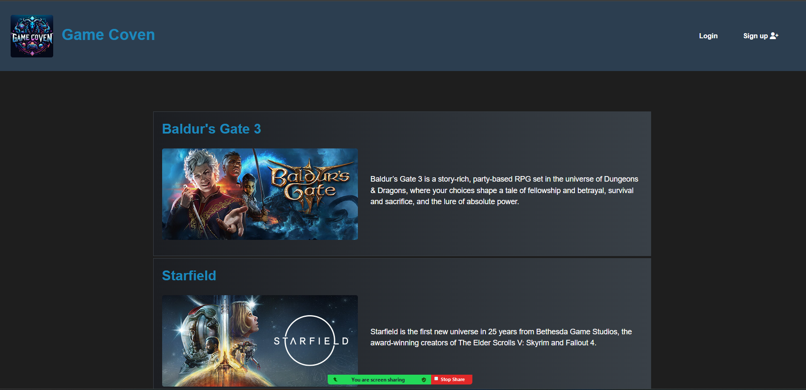

# Game-Coven

Game Coven is an engaging and dynamic gaming blog and community platform. It offers users the ability to sign up, log in, create profiles, post gaming-related content, and interact through comments. Designed with a sleek, gaming-centric aesthetic, Game Coven aims to be the go-to destination for gamers seeking to share experiences, reviews, and discussions about the latest in the gaming world.



## Table of Contents

- [Installation](#installation)
- [Usage](#usage)
- [Features](#features)
- [Technologies Used](#technologies-used)
- [Deployment](#deployment)
- [Contributing](#contributing)
- [Credits](#credits)

## Installation

To install this application, follow these steps:

1. Clone this repository to your local machine:

```bash
git clone https://github.com/AlirizaBagdat/Game-Coven.git
```
2. Navigate to the project directory:

```bash
cd Game-Coven
```
3. Install the required npm packages:

```bash
npm install
```
4. Set up your MySQL database and configure the `.env` file with your MySQL username, password, and database name.

5. Start the server using `npm start`.

# Usage

Once the server is running, navigate to `http://localhost:3001` in your web browser to view and interact with the website.

## Features

- **User Authentication**: Secure sign-up and login functionality.
- **Profile Management**: Users can create and maintain personal profiles.
- **Content Posting**: Ability to post game reviews, updates, and discussions.
- **Comments**: Users can comment on posts, facilitating community interaction.
- **Responsive Design**: The website is fully responsive, ensuring a seamless experience across various devices.

## Technologies Used

- **Frontend**: HTML, CSS, JavaScript
- **Backend**: [Node.js](https://nodejs.org/), [Express.js](https://expressjs.com/)
- **Database**: [MySQL](https://www.mysql.com/)
- **Template Engine**: [Handlebars.js](https://handlebarsjs.com/)

## Deployment

This application is deployed on Heroku. Check out the live application [here](https://game-coven-102039f7545e.herokuapp.com/).

## Contributing

Contributions to improve Game Coven are welcome. Please ensure to update tests as appropriate.

## Credits

**Mutasim Chaudhary**
- Github: [@Mutasim-c](https://github.com/Mutasim-c)

**Ali Kocaman**
- Github: [@KDragonuv](https://github.com/KDragonuv)

**Aliriza Bagdat**
- Github: [@AlirizaBagdat](https://github.com/AlirizaBagdat)

**Obiora Ezeasor Nwosu**
- Github: [@Obi1knube](https://github.com/Obi1knube)

**Rafal Lobzowski**
- Github: [@rlobz](https://github.com/rlobz)